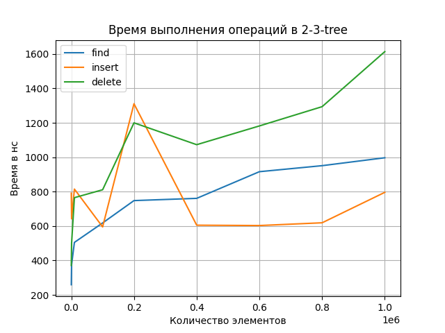

#Семестровая работа по АСД (2-3 tree)
Выполнили Кирасиров Данис и Камалов Нияз (11-104)

## Результаты



В теории все три операции должны выполняться за сложность O(log n). 
На получившимся графике мы видим скорее подтверждение этому. Отличия 
(особенно в начале графика) возможны из-за работы сборщика мусора,
работы других программ на компьютере или из-за особенности сгенерированных 
данных.

## Зависимости
Проект выполнен на языке программирования [Golang](https://go.dev/doc/install).
Генерация данных и отрисовка графиков осуществляется на [Python](https://www.python.org/downloads/).
Для запуска необходимо их установить.

## Структура проекта
```dataset/``` - папка с входными данными (генерируются)

```tree/``` - реализация 2-3 tree на golang

```utils/``` - вспомогательный код (для измерения времени и чтения входных данных)

```result/``` - результат измерений

```generate_dataset.py``` - скрипт генерации данных

```benchmark.go``` - скрипт замера времени выполнения

```make_plot.py``` - скрипт отрисовки получившихся данных

## Ход работы
Команды запуска будут указаны под Linux, т.к. работа велась на Ubuntu.

###Генерация входных данных
```sh
$ python3 generate_dataset.py
```
Создается 5 типов наборов входных данных, каждый тип это определённое
кол-во чисел (1е2, 1е3, ..., 1е6). Для каждого типа генерируется по 10 видов:
```
dataset/
  v1/
    100.csv
    1000.csv
    10000.csv
    100000.csv
    1000000.csv
  v2/
  ...
  v10/
  ...
```
### Бенчмаркинг
```sh
$ go run benchmark.go
```
Измеряется время исполнения 3-х операций: поиск, вставка и удаление. Измерения проходят отдельно для 
каждого типа входных данных. Для каждого набора выполняется по 100 проходов. В итоге 
делается по 100 измерений для каждого типа (v1/100.csv, v2/100.csv, ..., v10/100.csv), 
средний результат является итоговым. Перед измерениями в дерево добавляется весь входной набор.

Измерение поиска: поиск случайного элемента из входных данных

Измерения вставки: происходит удаление случайного элемента из входных данных и вставка обратно. Измеряется только операция вставки.

Измерения удаления: происходит удаление случайного элемента из входных данных и вставка обратно. Измеряется только операция удаления.

Результат записывается в папку ```result/``` в формате csv (кол-во данных, время в нс)